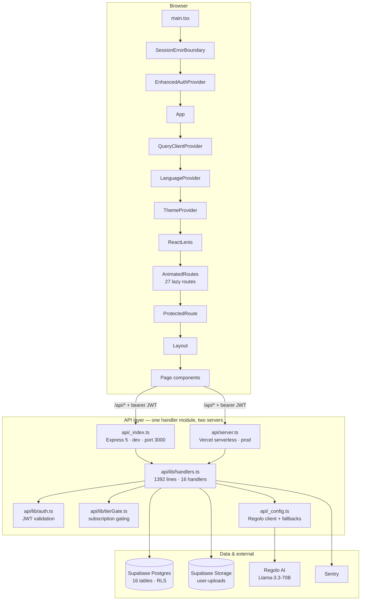
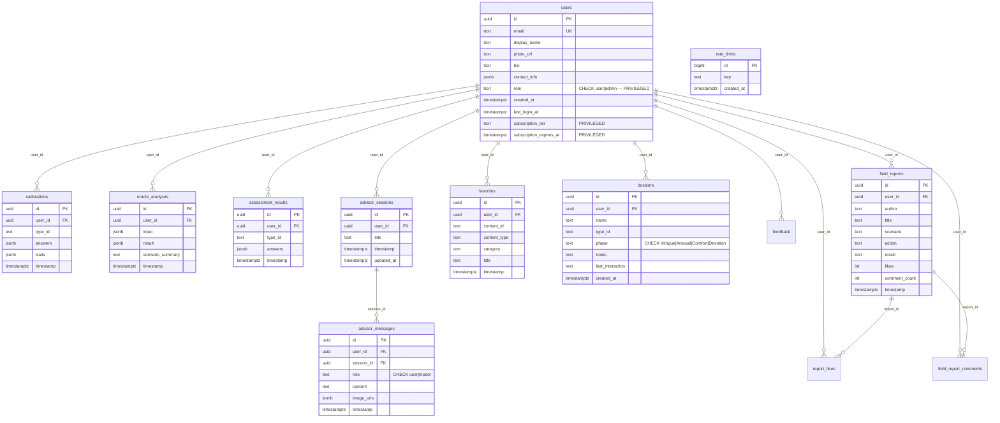
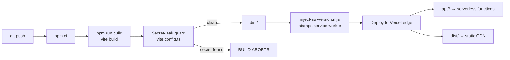

# Epimetheus

[](https://react.dev/)
[](https://vite.dev/)
[](https://www.typescriptlang.org/)
[](https://tailwindcss.com/)
[](https://supabase.com/)
[](https://expressjs.com/)
[](https://vercel.com/)
[](./LICENSE)

**Last verified: 2026-09-26** · verified against commit `37c2505f487fd1d43ab73eb7ec3d909767e7546f` (2026-09-12)

> **A note on this document.** Every number, path, table name, route, and
> environment variable below was read directly out of the repository at the
> commit above. Where a previous version of this README was wrong, the error is
> called out in [§13 Documentation corrections](#13-documentation-corrections)
> rather than quietly fixed. If you change the code, re-verify the section you
> invalidated and move the `Last verified` date.

---

## 1. What this is

Epimetheus is a web application for **personality profiling and
relationship-intelligence coaching**. A user completes a short typed
questionnaire that maps to one of eight archetypes (TDI / TJI / TDR / TJR / NDI /
NJI / NDR / NJR), then works through an "AI Oracle" calibration that turns a
described scenario into structured traits, indicators, and a task list. A
streaming advisor chat gives follow-up coaching against that context, the user
can log real-world outcomes as field reports, and personal collections
(favorites, dossiers) track people and content over time.

**Who it is for.** Coaches and their clients who want a structured,
repeatable vocabulary for reading interpersonal dynamics — and individual users
who are working through relationship patterns and want something more concrete
than a quiz result. The product is presented by **Yame Coaching** (per
`metadata.json`), so the primary audience is coaching clients rather than
self-serve consumer traffic.

The app is a **single-page React application** with a deliberately small API
surface: all business logic lives in one framework-agnostic handler module that
two different servers mount, so development and production cannot drift.

---

## 2. Tech stack

| Layer | Technology | Notes |
| --- | --- | --- |
| UI framework | **React 19** | Function components, hooks only |
| Build tool | **Vite 6** | Manual chunk splitting; secret-leak guard in `vite.config.ts` |
| Language | **TypeScript 5.8** (`~5.8.3`) | `strict` on; two separate projects for `src/` and `api/` |
| Styling | **Tailwind 4** (`@tailwindcss/postcss`) | Semantic CSS-variable token layer in `src/index.css` |
| Routing | **React Router 7** (`^7.14.1`) | 27 pages, all `lazy()`-loaded |
| Server state | **TanStack Query 5** | `src/lib/queryClient.ts` |
| Client state | **Zustand 5** | `src/stores/uiStore.ts` (persisted) |
| Context | React Context | `EnhancedAuthContext`, `ThemeContext`, `LanguageContext` |
| Animation | **Motion 12** (`motion` package) | `AnimatedRoutes`, modals |
| Smooth scroll | **Lenis 1.3** | `ReactLenis` in the app shell |
| Charts | **Recharts 3.8** | Trait and profile radar charts |
| Icons | **Lucide React** | |
| Markdown | **react-markdown 10** | Advisor message rendering |
| Command palette | **cmdk 1.1** | `CommandPalette.tsx` |
| Toasts | **Sonner 2** | |
| Backend (dev) | **Express 5** + **Helmet 8** | `api/_index.ts`, port 3000 |
| Backend (prod) | **Vercel serverless** | `api/server.ts` — same handler module |
| Database | **Supabase Postgres 15** | 16 tables, RLS enforced |
| Storage | **Supabase Storage** | `user-uploads` bucket |
| AI | **Regolo AI** — `Llama-3.3-70B-Instruct` | Server-side only; OpenRouter optional fallback |
| Auth | **Supabase Auth** | Email/password + Google OAuth |
| Payments | **Stripe** | *Wired but not live* — see [§7](#7-subscriptions-and-billing) |
| Errors | **Sentry** (optional) | No-ops without a DSN |
| PWA | Hand-written service worker | `public/sw.js` — **not** Workbox, see §13 |
| Tests | **Vitest 4** + Testing Library | 5 test files — see [§10](#10-testing) |
| Lint | **ESLint 9** flat config | `eslint.config.js` |

---

## 3. Architecture



**Why one handler module.** `api/lib/handlers.ts` exports 16 framework-agnostic
handlers that take a normalised request and return a normalised response. Both
the Express dev server and the Vercel function adapt their own request object
into that shape and call the same code. This is the single most important
architectural decision in the repo: it makes "works locally, breaks in prod"
structurally difficult.

**Where the seams are.** The frontend never talks to Supabase's data API with
the service role and never holds a server secret. Every privileged operation
goes through `/api/*` with the user's Supabase JWT in an `Authorization`
header, and the server re-derives the caller's identity from that token.

Full diagrams and per-directory detail: [`docs/architecture/README.md`](./docs/architecture/README.md).

---

## 4. Features

### Authentication and accounts
- Email/password sign-up and sign-in, plus Google OAuth with embedded-WebView detection (in-app browsers cannot complete the OAuth round trip, and the app detects and explains that instead of failing silently).
- Password recovery, handling both the request-email step and the post-recovery set-new-password step.
- Session loading with retry and a hard safety timer, so a slow network cannot strand the app on the loading screen.
- Self-serve account deletion with an email-address confirmation step. Cascades through the public profile row, all child rows, and the user's uploaded files. Admin-initiated deletion is a separate, server-verified route.
- Role model: `user` or `admin`. Admin reads and deletes are gated by a `SECURITY DEFINER` `is_admin()` helper that avoids the RLS recursion that would otherwise brick the admin dashboard.

### Personality assessments
- Short typed questionnaires (`src/data/assessmentQuestions.ts`) that resolve to one of 8 archetypes.
- Result page, comparison view, and an encyclopedia of archetypes.
- An assessment profiler and a quiz flow for reinforcement.

### AI Oracle calibration
- Structured-input analysis: the user describes a scenario, the server validates and clamps the payload, the model returns traits, indicators, tasks, and tactical guidance.
- Results persist to `oracle_analyses` (server-validated insert only) and can be browsed as history.
- Task checklists are persisted and toggled per analysis.
- Tier-gated server-side: the React route guard is convenience, the API enforces the same rule independently.

### AI advisor chat
- Streamed SSE conversations (`POST /api/advisor/chat`).
- Token-aware history truncation, so a long session does not blow the model context window.
- A calibration-aware system prompt using the EPIMETHEUS framework.
- Named sessions with create/read/delete, and per-message like/dislike reactions persisted back to `advisor_messages`.
- Client-disconnect handling: closing the tab cancels the upstream read.

### Field reports (community)
- Case studies with scenario / action / result, a comment thread, and likes.
- Like uniqueness is enforced by a `UNIQUE(user_id, report_id)` constraint, so double-taps cannot inflate a count.

### Dossiers and favorites
- Dossiers track a named person through a phase (`Intrigue` → `Arousal` → `Comfort` → `Devotion`) with notes and a last-interaction date.
- Favorites collect archetypes, guides, and calibrations, deduplicated by a `UNIQUE(user_id, content_type, content_id)` constraint.

### Insights
- Personal analytics over the user's own calibration history.

### Subscriptions
- Three tiers: `free`, `strategist`, `oracle`.
- Tier checks exist on both sides of the boundary. Stripe checkout is wired in code but **not live** — see [§7](#7-subscriptions-and-billing).

### Platform
- Installable PWA with an offline-capable app shell.
- Dark and light themes with an anti-flash bootstrap that applies the saved theme before React hydrates.
- i18n scaffolding (English and Filipino) via `LanguageContext`.
- Accessibility: labelled form controls, `role="alert"` error announcements, focus trapping in modals, 44×44px minimum touch targets, safe-area insets for notched devices, and WCAG-AA-checked colour tokens in both themes.

---

## 5. Quick start

### Prerequisites

| Requirement | Version |
| --- | --- |
| Node.js | **>= 20.0.0** (`engines` field) |
| npm | 10+ |
| Supabase project | Free tier is enough |
| Regolo AI API key | <https://regolo.ai> |

### Setup

```bash
# 1. Clone
git clone https://github.com/Yametech12/Final-Ghostcode.git
cd Final-Ghostcode

# 2. Install the exact locked tree
npm ci

# 3. Configure environment
cp .env.example .env
#    Then fill in at least the four required values in §6.

# 4. Apply the database schema — in lexicographic order, oldest first.
#    With the Supabase CLI:
supabase db reset
#    Without it: paste each file in supabase/migrations/ into the SQL editor.
#    Do NOT run the legacy root-level SQL files.

# 5. Run both servers
npm run dev
```

- Frontend: <http://localhost:5173>
- API: <http://localhost:3000>

### Verify your setup

```bash
npm run diagnose    # env + Supabase connectivity smoke test
curl http://localhost:3000/api/health
```

If the API exits immediately at boot, it is almost always one of: a missing
`VITE_SUPABASE_URL`, a missing `SUPABASE_SERVICE_ROLE_KEY`, or a service-role
key still holding its placeholder value. The dev server checks all three and
prints which one failed.

---

## 6. Environment variables

The complete annotated template lives in [`.env.example`](./.env.example) — that
file is the source of truth and this table mirrors it. **32 variables** are
declared.

### The `VITE_` prefix rule — read this first

Vite inlines every `VITE_`-prefixed variable into the client bundle **at build
time**. Whatever you prefix with `VITE_` is public, permanently, in every user's
browser. A server secret must never be `VITE_`-prefixed. `vite.config.ts`
contains a build-time guard that aborts the build when a forbidden name appears
or when a secret-shaped string is found in the emitted bundle, but the guard is
a backstop, not the rule.

### Required

| Variable | Purpose | Notes |
| --- | --- | --- |
| `VITE_SUPABASE_URL` | Supabase project URL | Client-visible. Backend also reads this — see §13. |
| `VITE_SUPABASE_ANON_KEY` | Supabase anon/publishable key | Client-visible by design; RLS is what protects data. |
| `SUPABASE_SERVICE_ROLE_KEY` | Server-side Supabase key | **Secret.** Bypasses RLS. Never `VITE_`-prefixed. |
| `REGOLO_API_KEY` | Regolo AI key | **Secret.** Never `VITE_`-prefixed. |

### Application and server

| Variable | Required | Purpose |
| --- | --- | --- |
| `APP_URL` | Optional | Canonical app URL, used in outbound links and mail. |
| `PORT` | Optional | Dev API port. Default `3000`. |
| `NODE_ENV` | Optional | `development` / `production`. Controls static file serving and error verbosity. |
| `LOG_LEVEL` | Optional | `info` \| `warn` \| `error` \| `debug`. Defaults to `info` in production, `debug` otherwise. |
| `ALLOWED_ORIGINS` | Optional | Comma-separated extra CORS origins, **appended** to the built-in list (localhost 5173/5174/3000, `epimetheusproject.vercel.app`, `epimetheus.ai`). |

### AI providers

| Variable | Required | Purpose |
| --- | --- | --- |
| `REGOLO_API_KEY` | **Yes** | Primary provider key. Server-only. |
| `REGOLO_API_ENDPOINT` | Optional | Defaults to `https://api.regolo.ai/v1`. |
| `OPENROUTER_API_KEY` | Optional | Fallback provider. Empty means disabled. Server-only. |

### Error monitoring

| Variable | Required | Purpose |
| --- | --- | --- |
| `VITE_SENTRY_DSN` | Optional | Client DSN. Client-visible by design. Empty = Sentry off. |
| `SENTRY_DSN` | Optional | Server DSN (Express + Vercel). Server-only. May reuse the client DSN. |

### Optional / reserved features

These are declared in `.env.example` but **not active in production**. Do not
assume setting them turns a feature on.

| Variable | Required | Status |
| --- | --- | --- |
| `VITE_RECAPTCHA_SITE_KEY` | Optional | Referenced by code that is gated on the var being non-empty. Empty = off. |
| `GMAIL_USER` | Optional | Reserved for an outbound verification-mail flow. |
| `GMAIL_APP_PASSWORD` | Optional | Reserved. **Secret.** |
| `VITE_GA_TRACKING_ID` | Optional | Google Analytics measurement ID, e.g. `G-XXXXXXXXXX`. |
| `VITE_API_BASE_URL` | Optional | Override the API base when frontend and API are hosted separately. Defaults to `/api`. |

### Stripe — declared, not live

| Variable | Required | Notes |
| --- | --- | --- |
| `STRIPE_SECRET_KEY` | — | **Secret.** Not yet in the live flow. |
| `STRIPE_WEBHOOK_SECRET` | — | **Secret.** Not yet in the live flow. |
| `VITE_STRIPE_PUBLISHABLE_KEY` | — | Client-visible by design. |
| `STRIPE_PRICE_STRATEGIST_MONTHLY` | — | A Stripe **Price ID** (`price_...`), not a dollar amount. |
| `STRIPE_PRICE_STRATEGIST_ANNUAL` | — | Price ID. |
| `STRIPE_PRICE_ORACLE_MONTHLY` | — | Price ID. |
| `STRIPE_PRICE_ORACLE_ANNUAL` | — | Price ID. |

### Google Cloud Storage — declared, unused

Seven variables (`GCP_PROJECT_ID`, `GCP_PROJECT_NUMBER`,
`GCP_SERVICE_ACCOUNT_EMAIL`, `GCP_BUCKET_NAME`, `VITE_GCP_BUCKET_NAME`,
`GCP_WORKLOAD_IDENTITY_POOL_ID`, `GCP_WORKLOAD_IDENTITY_PROVIDER_ID`) are
reserved for a possible storage migration. Nothing reads them today. Removing
them is a reasonable cleanup; leaving them is harmless but confusing.

---

## 7. Subscriptions and billing

| Tier | Enum value | What it unlocks |
| --- | --- | --- |
| Free | `free` | Assessment, encyclopedia, basic profile |
| Strategist | `strategist` | Oracle calibration, advisor chat, field reports, dossiers |
| Oracle | `oracle` | Everything above, plus expanded AI usage |

**Enforcement is server-side.** `api/lib/tierGate.ts` re-checks the tier on the
privileged handlers. The React route guard exists for the user's benefit (no
dead-end navigation), not as the security boundary. A paying-tier user's plan is
stored on `users.subscription_tier`, with an optional
`subscription_expires_at` timestamp.

**Stripe is not live.** The schema, the tier gates, the pricing page, and the
price-ID environment variables all exist, but there is no working checkout that
takes money and no webhook handler that flips a tier. Until that is built,
tiers are set by an admin. Treat every subscription UI as a preview.

Design notes and the intended (not yet implemented) flow:
[`docs/billing/stripe-flow.md`](./docs/billing/stripe-flow.md).

---

## 8. Database

The canonical schema is **`supabase/migrations/`** — 9 timestamped files applied
in lexicographic order. The root-level `supabase-schema-v2.sql` and the two SQL
files under `scripts/` are legacy duplicates kept for one release cycle and are
**not** authoritative. This is a correction from the previous README, which
named `supabase-schema-v2.sql` as canonical.

### Entity relationships



### All 16 tables

| Table | Purpose | Contains personal data |
| --- | --- | --- |
| `users` | Profile, role, subscription state | Yes — email, name, bio, `contact_info` |
| `calibrations` | Server-validated trait analyses | Yes |
| `oracle_analyses` | AI Oracle inputs and outputs | **Yes — free-text scenario descriptions** |
| `assessment_results` | Short-form assessment outputs | Yes |
| `advisor_sessions` | Advisor chat session metadata | Yes |
| `advisor_messages` | Advisor chat messages | **Yes — full conversation text** |
| `field_reports` | Community case studies | Yes — intentionally public to authenticated users |
| `report_likes` | Like records, unique per user+report | Indirectly |
| `field_report_comments` | Comments on field reports | Yes |
| `dossiers` | Named people tracked through phases | **Yes — third-party data, highest sensitivity** |
| `favorites` | Personal collections | Yes |
| `feedback` | User feedback | Yes |
| `rate_limits` | Rate-limit counters | No — pseudonymous key only |
| `verification_codes` | Short-lived numeric codes | Yes — email address |
| `public_config` | Non-sensitive app config | No |
| `private_config` | Server-only config | Possibly |

**Sensitive columns to protect specifically.** On `users`: `role`,
`subscription_tier`, `subscription_expires_at`, `email`, `contact_info`. These
are privilege or identity fields, and a policy that grants blanket `UPDATE` on
`users` lets a user promote themselves to admin or grant themselves a paid tier.
Column-level protection via trigger or service-role-only write is required — a
row-level policy alone is not sufficient.

### Row Level Security

RLS is enabled across the public tables, with `auth.uid() = user_id` as the
standard isolation predicate. Two rules that are easy to get wrong:

1. **`UPDATE` policies need `WITH CHECK` as well as `USING`.** `USING` decides
   which rows you may touch; `WITH CHECK` decides which rows you may leave
   behind. A `USING`-only `UPDATE` policy lets a user rewrite `user_id` on their
   own row to point at someone else's account.
2. **Admin policies must consult `is_admin()`, not query `users` directly from
   inside a policy on `users`.** A policy on `users` that reads `users` recurses
   (error 42P17) and takes the whole table offline.

---

## 9. API reference

All routes live under `/api/`. The same handlers are also reachable under
`/api/v1/*` — the dev server rewrites the version prefix so clients can pin to
`v1` without duplicated routes. In production the Vercel function
(`api/server.ts`) mounts the same handlers.

### Authentication and authorisation

Every route marked *required* resolves the caller from the Supabase JWT in the
`Authorization: Bearer <token>` header. **A `userId` appearing in a request body
or query string is ignored, always.**

| Method | Path | Auth | Role | Purpose |
| --- | --- | --- | --- | --- |
| GET | `/api/health` | Public | — | Liveness plus feature flags |
| GET | `/api/ai/test-key` | Public | — | Reports whether the AI key is configured. Does not echo the key. |
| GET | `/api/ai/credits` | Public | — | Always `404` — credits are not a Regolo concept |
| POST | `/api/security/log` | Public (rate-limited) | — | Best-effort client security-event logging |
| POST | `/api/upload/profile-photo` | Required | user | Avatar upload: magic-byte sniffed, size-capped, JWT-derived path |
| POST | `/api/advisor/session` | Required | tier-gated | Create a chat session |
| GET | `/api/advisor/session` | Required | own rows | Latest session plus its message history |
| DELETE | `/api/advisor/session/:sessionId` | Required | owner | Delete a session |
| PATCH | `/api/advisor/messages/:messageId/reaction` | Required | own rows | Set or clear a like/dislike |
| POST | `/api/advisor/chat` | Required | tier-gated | **SSE stream** — advisor reply |
| POST | `/api/oracle/analyses` | Required | tier-gated | Create an Oracle analysis (payload shape-validated and length-clamped server-side) |
| PATCH | `/api/oracle/analyses/:id/tasks` | Required | owner | Toggle task completion |
| DELETE | `/api/oracle/analyses/:id` | Required | owner | Delete an analysis |
| POST | `/api/ai/chat` | Required | tier-gated | Non-streaming AI completion |
| DELETE | `/api/users/me` | Required | self | Self-serve account deletion. Body requires `{ confirm: "<email>" }`. |
| DELETE | `/api/admin/users/:id` | Required | **admin** | Admin deletion of another user. Verifies the caller's admin role server-side and drives deletion through the auth admin API so the FK cascade actually fires. |

### Conventions

- **CSRF**: state-changing requests must send `Content-Type: application/json`
  or `X-Requested-With: XMLHttpRequest`. The `apiFetch` wrapper in
  `src/lib/fetch.ts` adds these automatically. A request without one is rejected
  with `403 CSRF_CHECK_FAILED`.
- **CORS**: explicit allow-list with `Vary: Origin`. Never `*` alongside
  credentials.
- **Rate limiting**: AI, advisor, and calibration routes share one bucket;
  `/api/security/log` has its own (legitimate clients emit several events per
  page load); `DELETE /api/users/me` has a much tighter one matching the
  production gate. In production this is a database-backed atomic counter; in
  the dev server it is in-process memory.
- **Errors**: `{ error, code, requestId? }`. An unhandled throw returns `500`
  with a truncated `requestId` that matches the server-side log line — quote it
  in a bug report and the request can actually be found.
- **Streaming**: `/api/advisor/chat` responds with `Content-Type:
  text/event-stream` and `Cache-Control: no-cache`. Closing the connection
  cancels the upstream read.

---

## 10. AI integration

| Property | Value |
| --- | --- |
| Primary provider | Regolo AI |
| Default model | `Llama-3.3-70B-Instruct` |
| Configured fallbacks | 3 (see `api/_config.ts`) |
| Optional secondary provider | OpenRouter (disabled when the key is empty) |
| Client entry | `src/lib/ai.ts` |
| Server client | `api/_config.ts` |
| Prompt assets | `src/components/advisor/prompts.ts`; framework context in the server handlers |

### How it is wired

The browser never calls an AI provider directly. It calls `/api/ai/chat` or
`/api/advisor/chat`; the server builds the prompt, attaches the caller's
calibration context, and calls Regolo with a server-side key. This keeps the key
out of the bundle and puts input validation, tier gating, and rate limiting on
one side of the boundary where they can actually be enforced.

### Prompt management

- Advisor system prompts carry the EPIMETHEUS framework context and few-shot
  examples, so tone and structure stay stable across turns.
- A per-user calibration summary is injected into the advisor context.
- History is truncated by token budget, not by message count.
- Oracle prompts include Filipino-language context, because the target audience
  is Filipino-speaking coaching clients.

### Data handling

- **User content is sent to the model provider to produce a reply.** That is
  inherent in the feature. It is disclosed in the privacy policy page.
- **The application does not train a model on user data, and does not operate a
  training pipeline.** There is no fine-tuning loop and no vector store in this
  repository.
- **Prompts and completions are persisted** — `oracle_analyses.input` /
  `.result` and `advisor_messages.content` — so a user can revisit their own
  history. They are stored in the user's own Supabase project and covered by RLS.
- **Do not put secrets in prompts.** Anything a user types into the advisor may
  be retained in `advisor_messages`.

### Cost and abuse controls

AI routes are rate-limited and tier-gated, and the streaming handler cancels the
upstream read when the client disconnects so an abandoned tab stops generating
billable output.

---

## 11. Deployment

Primary target: **Vercel**. The `api/` directory maps to serverless functions;
`dist/` is the static frontend.

### Steps

```bash
# 1. Apply the database schema before the first deploy.
#    Run every file in supabase/migrations/ in order.

# 2. Import the repository into Vercel.

# 3. Set environment variables in the Vercel project settings.
#    Required: VITE_SUPABASE_URL, VITE_SUPABASE_ANON_KEY,
#              SUPABASE_SERVICE_ROLE_KEY, REGOLO_API_KEY
#    SUPABASE_SERVICE_ROLE_KEY and REGOLO_API_KEY must NOT be VITE_-prefixed.

# 4. Build settings
#    Build command:  npm run build
#    Output:         dist
```

### Build pipeline



The secret-leak guard runs **inside** the build. If a forbidden `VITE_`-prefixed
name is present, or a secret-shaped string appears in the emitted bundle, the
build fails rather than shipping the leak. A failing build on this step is the
guard working — investigate, do not bypass.

### Security headers and CSP

Headers are defined in `api/lib/http.ts` and applied in `vercel.json` for the
static document, so the API and the HTML get consistent treatment. The CSP
excludes `'unsafe-inline'` from `script-src`. Consequence worth knowing: an
inline `<script>` in `index.html` **will be blocked in production**, which is
why the theme bootstrap lives in an external file rather than inline. If you add
an inline script, add a hash to the CSP or move it to a file.

> **Verification status.** The header and CSP work referenced above was produced
> by the security-hardening agents described in [`CHANGELOG.md`](./CHANGELOG.md).
> As of the last verified date those patches are **not applied** to `main`. The
> shipped `index.html` still contains an inline theme script and a
> `fonts.googleapis.com` stylesheet link, and `vercel.json` still has no
> `headers` block. Treat this section as the target state, and check the file
> before relying on it.

### Rate limiting

Production uses the atomic `record_and_count_rate_limit(rl_key, window_seconds)`
RPC, which inserts and counts in one statement so concurrent bursts cannot both
observe `count < limit`. The in-memory limiter in the dev server is a
convenience for local work only — it is per-instance and resets on restart.

Operational detail: [`docs/operations/deployment.md`](./docs/operations/deployment.md).

---

## 12. Security

The full policy, including how to report a vulnerability privately, is in
[`SECURITY.md`](./SECURITY.md). Threat model and control-by-control detail:
[`docs/security/threat-model.md`](./docs/security/threat-model.md).

### Controls in place

- **Server-derived identity.** Every authenticated handler resolves the user
  from the JWT. Body and query `userId` values are never trusted. This closes
  the single most common multi-tenant data-access bug.
- **Fail-closed CSRF gate.** No `Content-Type: application/json` and no
  `X-Requested-With` header means `403`, not "assume it's fine".
- **CORS allow-list** with `Vary: Origin`; never `*` with credentials.
- **CSP without `'unsafe-inline'` in `script-src`.**
- **Upload validation.** Magic-byte sniffing (PNG/JPEG/GIF/WEBP), a size cap,
  and a storage path derived from the JWT — so a user cannot choose where their
  file lands. Client-side direct storage writes were removed.
- **Server-side payload validation.** Oracle and calibration inputs are
  shape-checked and length-clamped before insert, so a compromised client cannot
  push arbitrary blobs into JSON columns.
- **Atomic rate limiting** on the production path.
- **Privilege-escalation guard.** A trigger on `users` protects the `role` and
  subscription columns.
- **Build-time secret guard** in `vite.config.ts`.
- **No `dangerouslySetInnerHTML`, `eval`, or `new Function`** in application
  code; markdown rendering goes through `react-markdown` and
  `src/utils/sanitizeHtml.ts`.

### Standing rules for contributors

1. **Never commit a `.env` file.** `.gitignore` blocks `.env` and its variants,
   but `.gitignore` does not protect a file that is already tracked.
2. **Never prefix a server secret with `VITE_`.**
3. **Rotate secrets after any suspicion of exposure** — and rotate on a
   schedule regardless. Step-by-step: [`docs/security/secrets-rotation.md`](./docs/security/secrets-rotation.md).
4. **Never trust a client-supplied identifier** for identity or ownership.
5. **A new table without RLS is a breach.** Enable RLS, write policies for all
   four verbs, and put `WITH CHECK` on every non-read-only policy.

### Known accepted risks

Documented, deliberate, and listed in `SECURITY.md` so they are not re-reported:
session tokens live in `localStorage` (moving to `HttpOnly` cookies is a
cross-cutting auth change); the dev server's rate limiter is in-process; Sentry
is optional and no-ops without a DSN.

---

## 13. Documentation corrections

Documentation drift is a real defect: a contributor who follows a stale document
loses an afternoon. These are the errors found in the previous versions of these
files, stated plainly so the corrections can be verified rather than trusted.

| Was claimed | Actually | Where |
| --- | --- | --- |
| Canonical schema is `supabase-schema-v2.sql` | Canonical schema is `supabase/migrations/` (9 files). The root file is a legacy duplicate. | old README |
| "23 lazy-loaded routes" | 27 page components in `src/pages/*.tsx` | `DEEP_ANALYSIS.md` |
| Workbox powers the PWA | `public/sw.js` is a hand-written service worker (112 lines). No Workbox dependency. | `DEEP_ANALYSIS.md` |
| "Tests: … coverage is sparse (one util test)" | 5 test files: `api/lib/handlers.test.ts`, `api/lib/auth.test.ts`, `src/utils/sanitizeHtml.test.ts`, `src/utils/json.test.ts`, `src/utils/validation.test.ts` | old README |
| "Run all three SQL files before the first deploy" | There are **9** migration files, not 3 | old README |
| `src/components/Layout.tsx` | The file is `src/components/layout/Layout.tsx` (lowercase directory) | `FIXES_APPLIED.md`, `TODO.md` |
| Model fallbacks include Llama-3.1-8B | A later commit (`f358810`) explicitly removed the invalid Llama-3.1-8B model | `DEEP_ANALYSIS.md` |
| `TODO.md` lists open work | Every item was already fixed — the file is archived at [`docs/archive/2026-q3-todos.md`](./docs/archive/2026-q3-todos.md) | `TODO.md` |
| `STRUCTURE.md` describes the tree | It named `api/_server.ts` and `api/index.ts` (never existed), `api/ai/` (no such directory), and a `scripts/debug-script.js` (gitignored, not tracked). Rewritten. | `STRUCTURE.md` |
| "License: Private and proprietary" | `package.json` declared no `license` field at all, and there is no LICENSE file. `LICENSE` now exists (MIT) and `package.json` declares `MIT` — **confirm this matches your intent** | old README |

Two naming inconsistencies remain in the repository and are recorded rather than
silently changed:

- `package.json` `"name"` is **`react-example`**, a scaffold default, while
  `metadata.json` says **`Remix: Epimetheus`** and `index.html`'s title is
  **`EPIMETHEUS`**. Three names for one product.
- The file **`STRUCTURE.md`** is misspelled (should be `STRUCTURE.md` →
  `STRUCTURE.md` is what the task requested, so the filename is kept as-is for
  compatibility and the typo is noted here instead of being renamed out from
  under any external link).

---

## 14. Testing

```bash
npm test              # vitest, single run
npm run test:watch    # watch mode
npm run test:ui       # Vitest UI
```

**Current state.** 5 test files cover the two highest-risk areas (API handlers
and auth) plus three utilities. There are **no component tests and no hook
tests**, and no coverage threshold is enforced. This is the largest single gap
in the codebase and the highest-value place to contribute — see
[`CONTRIBUTING.md`](./CONTRIBUTING.md#good-first-contributions).

Run `npx vitest run` for the current pass count rather than trusting a figure
quoted in prose; the number changes with every PR.

Tests are excluded from `tsc --noEmit`, which means a test file can hold a type
error and still pass CI. A known weakness, recorded in
[`CHANGELOG.md`](./CHANGELOG.md) under *Unreleased*.

---

## 15. Contributing

Read [`CONTRIBUTING.md`](./CONTRIBUTING.md). It covers environment setup, coding
standards, the Conventional Commits convention, the fork-and-PR workflow, and
the database and API change checklists. Participation is governed by the
[Code of Conduct](./CODE_OF_CONDUCT.md).

The pre-push gate, which must pass:

```bash
npm run lint:all && npm test && npm run build
```

---

## 16. Screenshots

> **Coming soon — placeholders below.** No screenshots are committed in this
> repository yet, and inventing them would be worse than not having them.

| Screen | Status |
| --- | --- |
| Landing page (dark) | Coming soon |
| Archetype result | Coming soon |
| Oracle calibration flow | Coming soon |
| Advisor chat | Coming soon |
| Insights dashboard | Coming soon |
| Light theme | Coming soon |

**How to add one.** Capture at a consistent width (1440px desktop, 390px mobile)
and a 2× device pixel ratio, save as PNG into `docs/assets/screenshots/`, then
replace the row with:

```markdown
| Landing page (dark) |  |
```

Use a **relative path inside the repository**, not a hosted URL — a link to a
private drive or an expiring CDN URL becomes a broken image for every future
reader. Keep each file under 500 KB; compress before committing. Never include
real user data, a real email address, or a populated API key in a screenshot —
blur or use seed data.

---

## 17. Versioning

**There are no tagged releases** (`git tag` is empty as of the last verified
date). The repository ships continuously from `main` to Vercel. Change history
is tracked in [`CHANGELOG.md`](./CHANGELOG.md), which follows
[Keep a Changelog](https://keepachangelog.com/en/1.1.0/) and intends to follow
[Semantic Versioning](https://semver.org/spec/v2.0.0.html) once the first
release is tagged.

`package.json` `"version"` is currently `0.0.0` — a scaffold default, not a
release. Do not read it as a version number.

---

## 18. Licence

[MIT](./LICENSE). Copyright (c) 2026 Yametech12.

> **Confirm before publishing.** The previous README said *"Private and
> proprietary"*. MIT and proprietary cannot both be true. The copyright holder
> is set to `Yametech12` because that is the repository owner and no `author`
> or `license` field existed to read it from. If this project is meant to be
> closed-source, delete `LICENSE` and set `"license": "UNLICENSED"` in
> `package.json` instead.

---

## 19. Acknowledgements

- **React**, **Vite**, **Tailwind CSS**, **Vitest**, **TanStack Query**,
  **Zustand**, **Motion**, **Lenis**, **Recharts**, **Lucide**, **cmdk**, and
  **Sonner** — all MIT-licensed open source, and the reason this app exists in
  the shape it does.
- **Supabase** — Postgres, Auth, and Storage in one dependency.
- **Regolo AI** — inference for the Oracle and the advisor.
- **Contributor Covenant** — the text of [`CODE_OF_CONDUCT.md`](./CODE_OF_CONDUCT.md).
- **Yame Coaching** — the EPIMETHEUS framework and the product's domain expertise.

---

## 20. Trademarks

"Epimetheus", "EPIMETHEUS", and the EPIMETHEUS assessment framework are used in
this project as product branding. React, Vite, Tailwind CSS, Supabase,
Express, Vercel, Stripe, Sentry, Regolo AI, and OpenRouter are trademarks of
their respective owners. Their names appear here descriptively, to state what
the software runs on; **no affiliation with or endorsement by any of them is
implied.** The MIT licence in [`LICENSE`](./LICENSE) covers this repository's
source code — it grants no rights to any third-party trademark.

---

**Last verified: 2026-09-26** — against `37c2505f487fd1d43ab73eb7ec3d909767e7546f`.
