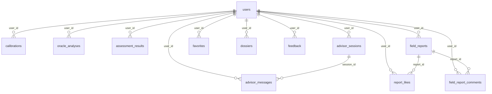

# Architecture

**Last verified: 2026-09-26** · against commit `37c2505f487fd1d43ab73eb7ec3d909767e7546f` (2026-09-12)

---

## 1. Layers

```
┌──────────────────────────────────────────────────────────────────────────┐
│ PRESENTATION — src/                                                      │
│  React 19 · Vite 6 · TypeScript 5.8 strict · Tailwind 4                  │
│  27 pages (all lazy()) · 50+ components · 11 hooks                       │
│  State: TanStack Query (server) · Zustand (UI) · Context (auth/theme/i18n)│
└────────────────────────────────┬─────────────────────────────────────────┘
                                 │ HTTPS · /api/* · Authorization: Bearer
                                 │ Content-Type: application/json (CSRF gate)
┌────────────────────────────────▼─────────────────────────────────────────┐
│ APPLICATION — api/                                                        │
│  ONE handler module, TWO mounts:                                          │
│    api/_index.ts   Express 5        dev, :3000                            │
│    api/server.ts   Vercel function  prod                                  │
│  api/lib/handlers.ts — 16 framework-agnostic handlers, 1392 lines         │
│  Cross-cutting: lib/auth.ts (JWT) · lib/tierGate.ts · lib/http.ts          │
│                 lib/log.ts · lib/sentryNode.ts                            │
└───────┬─────────────────────┬──────────────────────┬──────────────────────┘
        │                     │                      │
        ▼                     ▼                      ▼
┌───────────────┐   ┌──────────────────┐   ┌─────────────────────┐
│ Supabase      │   │ Supabase Storage │   │ Regolo AI           │
│ Postgres 15   │   │ user-uploads     │   │ Llama-3.3-70B-      │
│ 16 tables     │   │ RLS-scoped paths │   │ Instruct + fallbacks│
│ RLS enforced  │   │                  │   │ (OpenRouter optional)│
└───────────────┘   └──────────────────┘   └─────────────────────┘
```

---

## 2. Why one handler module, two servers

### The problem it solves

Development runs Express; production runs a serverless function. In most
codebases that means two sets of middleware, two validation paths, and a class of
bug that only reproduces in production. This repository closes that hole
structurally.

### The contract

Handlers accept and return plain objects:

```ts
export interface NormalizedRequest {
  method: string;
  body: unknown;
  query: Record<string, unknown>;
  params: Record<string, string>;
  headers: Record<string, string | string[] | undefined>;
  user: AuthenticatedUser | null;   // SERVER-DERIVED — never from the body
}

export interface NormalizedResponse {
  status: number;
  body?: unknown;
  stream?: AsyncIterable<string>;   // SSE, for /api/advisor/chat
  cancel?: () => void;              // called on client disconnect
}
```

Each mount adapts its own framework into this shape:

```ts
// api/_index.ts
async function normalize(req: express.Request): Promise<NormalizedRequest> {
  const user = await getAuthenticatedUser(req.headers.authorization, supabase);
  return { method: req.method, body: req.body, query: req.query,
           params: req.params, headers: req.headers, user };
}
```

**Consequence:** there is exactly one implementation of each route, and it cannot
tell which server called it. Dev/prod drift is not a discipline problem here, it
is impossible by construction.

### The cost

Adding a route means editing **three** files: the handler in
`api/lib/handlers.ts`, the registration in `api/_index.ts`, and the registration
in `api/server.ts`. Registering in only one is the most common way this codebase
drifts. `CONTRIBUTING.md` §7 makes this an explicit checklist item.

### The weakness

1392 lines mixing every domain. Splitting it into `lib/handlers/advisor.ts`,
`oracle.ts`, `users.ts`, `admin.ts` with the current file re-exporting for
compatibility is a pure move — no runtime change — which is exactly why it
deserves a separate PR a reviewer can verify by skimming rather than reasoning
about behaviour.

---

## 3. Request lifecycle — an authenticated AI call

```
1. User submits a scenario in CalibrationPage
2. Frontend → apiFetch('/api/oracle/analyses', { method: 'POST', body })
      apiFetch attaches:  Authorization: Bearer <supabase access_token>
                          Content-Type: application/json
3. Either mount receives it.
      Express:  helmet → json body parse → rate limit → security headers
                → CORS → /api/v1 rewrite → CSRF gate
      Vercel:   platform → handler
4. normalize() → getAuthenticatedUser(authHeader, supabase)
      JWT verified against Supabase. Returns { id, email, role? }.
      Failure → 401. The request never reaches a handler.
5. handleCreateOracleAnalysis(req, supabase)
      a. req.user missing?                       → 401
      b. tier check via lib/tierGate.ts          → 403 if under-tiered
      c. validate + clamp every untrusted field  → 400 on shape violation
      d. build prompt, call Regolo via _config.ts
      e. persist to oracle_analyses with user_id = req.user.id
6. Response → NormalizedResponse → 200 with the created row
7. Any unhandled throw → 500 with a truncated requestId that matches the
   server log line, so a bug report can actually be traced.
```

**Steps 4b–4d are the security boundary.** Every one of them is enforced on the
server. The React route guard that also blocks a free user from reaching the
calibration page is a courtesy — it prevents a dead end for the user, and
removing it would make the UX worse without making the system safer.

---

## 4. Data model

### Full schema (16 tables)

#### `users`
| Column | Type | Notes |
| --- | --- | --- |
| `id` | `uuid` PK | `default gen_random_uuid()`; FK → `auth.users` added by migration `20240101000700` |
| `email` | `text` UNIQUE | **Sensitive** |
| `display_name` | `text` | **Sensitive** |
| `photo_url` | `text` | Storage path |
| `bio` | `text` | **Sensitive** |
| `contact_info` | `jsonb` | **Sensitive** |
| `role` | `text` | `CHECK (role IN ('user','admin'))` — **PRIVILEGED** |
| `created_at` | `timestamptz` | `default now()` |
| `last_login_at` | `timestamptz` | |
| `subscription_tier` | `text` | added by `20240101000300` — **PRIVILEGED** |
| `subscription_expires_at` | `timestamptz` | added by `20240101000800` — **PRIVILEGED** |

#### `calibrations`
`id` uuid PK · `user_id` uuid FK→users ON DELETE CASCADE · `type_id` text NOT NULL ·
`answers` jsonb · `traits` jsonb · `timestamp` timestamptz default now()

#### `oracle_analyses`
`id` uuid PK · `user_id` uuid FK→users CASCADE · `timestamp` timestamptz ·
`input` jsonb NOT NULL · `result` jsonb NOT NULL · `scenario_summary` text
*Note:* the client reads `scenarioSummary` (camelCase) while the column is
snake_case — any query must alias it, or the field silently arrives `undefined`.

#### `assessment_results`
`id` uuid PK · `user_id` uuid FK→users CASCADE · `type_id` text NOT NULL ·
`answers` jsonb · `timestamp` timestamptz

#### `advisor_sessions`
`id` uuid PK · `user_id` uuid FK→users CASCADE · `title` text NOT NULL ·
`timestamp` timestamptz · `updated_at` timestamptz

#### `advisor_messages`
`id` uuid PK · `user_id` uuid FK→users CASCADE · `session_id` uuid FK→advisor_sessions
(**no CASCADE**) · `role` text `CHECK (role IN ('user','model'))` · `content` text
NOT NULL · `image_urls` jsonb · `timestamp` timestamptz
Plus a reaction column added by `20240101000800_advisor_reactions.sql`.

#### `field_reports`
`id` uuid PK · `user_id` uuid FK→users CASCADE · `author` text NOT NULL · `type` text
NOT NULL · `title` text · `scenario` text NOT NULL · `action` text NOT NULL ·
`result` text NOT NULL · `timestamp` timestamptz · `likes` integer default 0 ·
`comment_count` integer default 0
*Note:* `title` was added later; the migration backfills it from `scenario`.

#### `report_likes`
`id` uuid PK · `user_id` uuid FK · `report_id` uuid FK→field_reports CASCADE ·
`timestamp` timestamptz · **`UNIQUE(user_id, report_id)`** — prevents double-counting.

#### `field_report_comments`
`id` uuid PK · `report_id` uuid FK→field_reports CASCADE · `user_id` uuid FK ·
`author` text NOT NULL · `content` text NOT NULL · `timestamp` timestamptz

#### `favorites`
`id` uuid PK · `user_id` uuid FK · `content_id` text NOT NULL · `content_type` text
`CHECK IN ('type','guide','calibration')` · `category` text
`CHECK IN ('Personality','Content','Assessment')` · `title` text NOT NULL ·
`timestamp` timestamptz · **`UNIQUE(user_id, content_type, content_id)`**

#### `dossiers`
`id` uuid PK · `user_id` uuid FK · `name` text NOT NULL · `type_id` text NOT NULL ·
`phase` text `CHECK IN ('Intrigue','Arousal','Comfort','Devotion')` · `notes` text ·
`last_interaction` text · `created_at` timestamptz
**Contains data about third parties who never consented. Highest sensitivity in the system.**

#### `feedback`
`id` uuid PK · `user_id` uuid FK · `user_name` text · `email` text · `type` text
`CHECK IN ('bug','feature','general','praise','suggestion','content','ui','performance')` ·
`message` text NOT NULL · `created_at` timestamptz · `url` text · `user_agent` text

#### `rate_limits`
`id` bigint identity PK · `key` text NOT NULL · `created_at` timestamptz default now()
Index `(key, created_at DESC)`. A trigger deletes rows older than 5 minutes, so
the table stays small without `pg_cron`. RLS enabled with **no policies** — which
means service-role only, which is exactly who should touch it.

#### `verification_codes`
`email` text PK · `code` text `CHECK (length(code) = 6)` · `expires_at` bigint NOT NULL

#### `public_config`, `private_config`
`id` text PK · `data` jsonb NOT NULL

### Entity relationships



### Migration order — apply all nine, in this order

| # | File | What it does |
| --- | --- | --- |
| 1 | `20240101000000_initial_schema.sql` | 15 tables + `ALTER TABLE … ENABLE ROW LEVEL SECURITY` |
| 2 | `20240101000100_rls_audit.sql` | `is_admin()` SECURITY DEFINER helper + policy fixes |
| 3 | `20240101000200_rate_limits.sql` | `rate_limits` table + atomic `record_and_count_rate_limit` RPC |
| 4 | `20240101000300_subscription_tiers.sql` | `subscription_tier` column |
| 5 | `20240101000400_security_hardening.sql` | Triggers, column locks, policy tightening |
| 6 | `20240101000500_storage_lifecycle.sql` | Storage cleanup triggers |
| 7 | `20240101000600_rate_limit_hardcap.sql` | `HARD_CAP` short-circuit to stop writes on abusive keys |
| 8 | `20240101000700_users_auth_fk.sql` | `users.id` → `auth.users` FK |
| 9 | `20240101000800_advisor_reactions.sql` | Message reactions + `subscription_expires_at` |

**Deprecated duplicates — do not edit, and prefer deleting:**
`supabase-schema-v2.sql` (root), `scripts/rls-audit.sql` (370 lines),
`scripts/create-rate-limits-table.sql` (87 lines). They duplicate schema that
`supabase/migrations/` owns, and their presence causes a contributor to edit the
wrong file.

### The migration that matters most: `20240101000700_users_auth_fk.sql`

Before it, `public.users` and `auth.users` were unrelated tables that happened to
share a UUID. Deleting a row from `public.users` left the `auth.users` row intact
— the "ghost account": the email stayed taken, sign-in still succeeded, and the
profile was gone. Both deletion paths (`handleDeleteMyAccount` for self-serve,
`handleAdminDeleteUser` for admin) now drive deletion through the auth admin API
so the FK cascade actually fires.

---

## 5. Frontend structure

### Provider composition (`src/App.tsx`, 51 lines)

```
main.tsx (166)
  └─ SessionErrorBoundary      catch render errors before providers mount
       └─ EnhancedAuthProvider (634)
            │  loadSession() with retries + 8s hard safety timer
            │  so a slow network cannot strand the app on the loading screen
            └─ App
                 ├─ ErrorBoundary
                 ├─ QueryClientProvider    TanStack Query
                 ├─ LanguageProvider       en → fil
                 ├─ ThemeProvider          dark / light, anti-FOUC bootstrap
                 ├─ ReactLenis             smooth scroll
                 └─ AnimatedRoutes (416)   27 lazy routes
                      └─ ProtectedRoute → Layout → PageWrapper (motion)
```

**Ordering is load-bearing.** `SessionErrorBoundary` sits outside the auth
provider because a throw inside auth would otherwise take down the whole app with
no fallback. `QueryClientProvider` sits inside `App` so it can read context.

### Route table

Public: `/login`, `/register`, `/reset-password`.
Admin-gated: `/admin` (requires `users.role = 'admin'`, verified server-side too).
Authenticated: everything else. Catch-all redirects to `/`.

```
/  /profile  /assessment  /assessment-result
/calibration  /profiler  /quiz  /compare  /simulation  /decryptor
/advisor  /encyclopedia  /guide  /field-guide  /glossary  /quick-reference
/favorites  /dossiers  /insights  /admin
```

27 page components in `src/pages/*.tsx`. Per-file line counts: [`../../STRUCTURE.md`](../../STRUCTURE.md) §4.

### Where colour lives

**`src/index.css` (753 lines) is the single source of colour truth.** It defines
a semantic token layer and the `.light-theme` overrides. A component writes
`bg-mystic-900` or `var(--color-status-error)`, never `#0e0b12`.

This matters more than it sounds. A hard-coded literal does not flip when
`.light-theme` activates, which is precisely how the light theme accumulated
contrast ratios around 2.5:1 — unreadable text on cream, invisible to anyone
testing only in dark mode. The palette itself is a deliberate decision recorded
in `.kiro/specs/premium-ui-redesign/design.md`: champagne gold `#E8C77E`, antique
gold `#D4AF37` for hover/active, warm near-black `#0E0B12`.

Chart components (Recharts, SVG) receive colours as **props** from the token
layer rather than using `var()` inside SVG attributes, which do not resolve
reliably across engines.

---

## 6. Streaming (SSE)

`POST /api/advisor/chat` is the only streaming route.

```ts
if (result.stream) {
  res.setHeader('Content-Type', 'text/event-stream');
  res.setHeader('Cache-Control', 'no-cache');
  res.setHeader('Connection', 'keep-alive');
  const onClose = () => result.cancel?.();   // client gone → stop upstream
  res.req.once('close', onClose);
  for await (const chunk of result.stream) {
    if (res.destroyed) break;
    try { res.write(chunk); } catch { break; }   // EPIPE → bail
  }
  res.req.off('close', onClose);
  if (!res.destroyed) res.end();
}
```

Three properties worth preserving if you touch this:

1. **Cancellation is wired.** Closing the tab calls `result.cancel()`, which stops
   reading the upstream. Without this, an abandoned tab keeps generating billable
   model output.
2. **Errors are swallowed at the socket level on purpose.** Once a byte has been
   written you cannot change the status code, so a write failure must break the
   loop rather than attempt an error response.
3. **Compression must skip `text/event-stream`.** If a compression middleware
   buffers the SSE body to compress it, time-to-first-token jumps. Any
   `compression()` filter must exclude it.

---

## 7. Authorisation layers

| Layer | Mechanism | Actually enforced? |
| --- | --- | --- |
| Route access | `ProtectedRoute` (SPA) | No — UX only |
| Admin pages | `role === 'admin'` (SPA) | No |
| Admin API | `handleAdminDeleteUser` re-checks role server-side | **Yes** |
| Tier gating | `api/lib/tierGate.ts` | **Yes** |
| Row ownership | RLS `auth.uid() = user_id` | **Yes** |
| Privileged columns | Trigger / service-role-only write | **Yes**, with a caveat |

**The caveat.** The audit found the column-lock trigger
(`lock_privileged_user_columns`) **inert** and a column `REVOKE` to be a no-op.
So `role` / `subscription_tier` / `subscription_expires_at` protection is
present in intent, not in effect, until the hardening migration is applied. A
control that exists in a file is not a control that is running — verify with SQL,
not with a code read:

```sql
select tgname, tgenabled from pg_trigger where tgrelid = 'public.users'::regclass;
select grantee, privilege_type, column_name
from information_schema.column_privileges
where table_name = 'users';
```

---

## 8. Known architectural weaknesses

Ordered by consequence, not by effort.

| # | Weakness | Consequence |
| --- | --- | --- |
| 1 | `handlers.ts` at 1392 lines holds every domain | Review and merge-conflict cost; no isolation for testing |
| 2 | `CalibrationPage.tsx` at 1933 lines with 21 `useState` | The most-used page is also the least testable; refactors are high-risk bets |
| 3 | No CI | Nothing gates a merge; the type-check, tests, and build run only if a human remembers |
| 4 | 5 test files, zero component/hook tests | The streaming hook (435 lines) drives a real protocol with no test |
| 5 | Test files excluded from `tsc --noEmit` | A type error inside a test passes CI — the gate has a hole in it |
| 6 | Session tokens in `localStorage` | Any XSS escalates to full account takeover |
| 7 | 32 feature components flat in `src/components/` | Discoverability; `components/` has no signal |
| 8 | `@vercel/node` as a production dependency | It is used for a type-only import, and it is the path that pulls in the critical `tar` advisory |
| 9 | Two canvas libraries | Duplicate code paths and bundle weight for one capability |
| 10 | Legacy SQL duplicates | A contributor edits the wrong schema file |

---

**Last verified: 2026-09-26**
