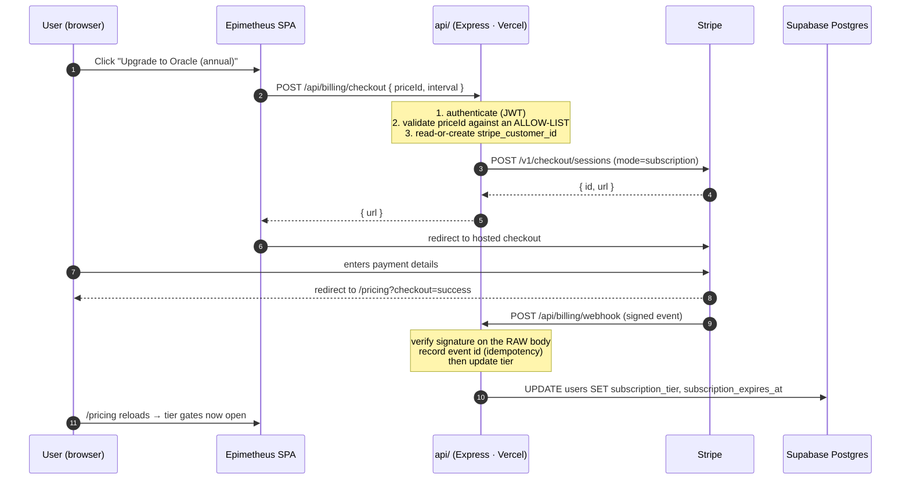

# Stripe Billing Flow — Design (Not Implemented)

**Last verified: 2026-09-26** · against commit `37c2505f487fd1d43ab73eb7ec3d909767e7546f` (2026-09-12)

> ## ⚠ This document describes a design that is NOT BUILT
>
> **Stripe is not live.** As of the last verified date:
>
> - No checkout session is created anywhere in the codebase.
> - There is **no webhook handler**. Nothing flips a tier automatically.
> - The `stripe` npm package is **not a dependency** — it is not in
>   `package.json`.
> - The 7 Stripe variables in `.env.example` are declared and unread. `.env.example`
>   labels them *"checkout integration (work in progress, not live yet)"*.
> - Tiers are currently set **manually by an administrator**.
>
> **Do not treat any of the following as documentation of current behaviour.**
> It is a target design, written so that whoever implements it starts from a
> decision rather than a blank page. If you ship this, update this banner in the
> same pull request — a design doc that still says "not implemented" after the
> code lands is worse than no design doc, because it teaches the reader to
> distrust the documentation.

---

## 1. Current state

### What exists

| Piece | Where | State |
| --- | --- | --- |
| Tier enum: `free` \| `strategist` \| `oracle` | `users.subscription_tier` | ✅ Present |
| Expiry timestamp | `users.subscription_expires_at` | ✅ Present (migration `20240101000800`) |
| Server-side tier gate | `api/lib/tierGate.ts` (234 lines) | ✅ Enforces on privileged handlers |
| Pricing page | `src/pages/PricingPage.tsx` (940 lines) | ✅ Renders, with annual/monthly display |
| Paywall UI | `src/components/PaywallScreen.tsx` | ✅ Renders |
| Subscription card | `src/components/SubscriptionCard.tsx` | ✅ Renders |
| Tier hook | `src/hooks/useSubscription.ts` (61 lines) | ✅ Reads tier from context |
| Stripe env placeholders | `.env.example` | ⚠ Declared, unread |
| Checkout session creation | — | ❌ Absent |
| Webhook handler | — | ❌ Absent |
| `stripe` package | `package.json` | ❌ Absent |
| Customer portal link | — | ❌ Absent |
| Subscription records table | — | ❌ Absent |

### The gap, stated plainly

A user can see a paywall and cannot pay. The tier columns exist and nothing
writes to them except an admin. This is the single largest business-blocking gap
in the repository: the product has a monetisation screen and no mechanism to
collect money.

### Why `subscription_expires_at` matters even before Stripe

The audit flagged this column as **unchecked**. Once it is written, every tier
check must read it. A tier gate that checks `subscription_tier === 'oracle'` and
ignores `subscription_expires_at` grants permanent access to anyone who was ever
subscribed — including a cancelled chargeback. Treat the pair as one value:

```ts
// The only correct tier predicate. Both halves, every time.
function isEntitled(user: User): boolean {
  if (user.subscription_tier && user.subscription_tier !== 'free') {
    if (user.subscription_expires_at === null) return true;      // non-expiring (admin-granted)
    return new Date(user.subscription_expires_at) > new Date();  // time-limited
  }
  return false;
}
```

---

## 2. Intended flow



### Why hosted checkout, not Stripe Elements

| | Hosted checkout | Embedded Elements |
| --- | --- | --- |
| PCI scope | Minimal — card data never touches our origin | Larger — a payment form on our domain |
| Work | One redirect | Form, validation, 3DS handling, error states |
| Branding | Stripe-hosted page | Full control |
| Mobile | Stripe maintains it | We maintain it |

For a product at this stage, hosted checkout is the correct trade. Revisit only
if conversion data shows the redirect losing users.

---

## 3. Required pieces

### 3.1 New table: `stripe_events` (idempotency)

**This is the piece people forget, and the one that moves money.**

Stripe **retries webhooks** and can deliver the same event more than once. Without
an idempotency record, a retried `invoice.paid` extends the subscription twice. A
unique constraint on the event id makes a repeated delivery a no-op:

```sql
create table if not exists public.stripe_events (
  id text primary key,               -- Stripe event id (evt_...)
  type text not null,
  processed_at timestamptz not null default now()
);
alter table public.stripe_events enable row level security;
-- No policies: service-role only. The webhook runs as the service role.
```

The handler's first statement is the insert. A unique-violation means "already
processed" — return `200` and stop. **Only insert after the work succeeds**, or a
crash mid-handler permanently marks an event as done.

### 3.2 New column: `users.stripe_customer_id`

```sql
alter table public.users add column if not exists stripe_customer_id text unique;
```

Without it, a returning customer who changes plan creates a second Stripe
customer and the account ends up with two subscriptions.

### 3.3 Endpoints to add

| Method | Path | Auth | Purpose |
| --- | --- | --- | --- |
| POST | `/api/billing/checkout` | Required | Create a checkout session, return the redirect URL |
| POST | `/api/billing/portal` | Required | Create a billing-portal session so users can cancel or change card |
| POST | `/api/billing/webhook` | **Signature-verified, NOT JWT** | Receive Stripe events |

All three go in `api/lib/handlers.ts` and must be registered in **both**
`api/_index.ts` and `api/server.ts` — the two-mounts rule from
[`../architecture/README.md`](../architecture/README.md) §2.

---

## 4. Security requirements

These are not optional hardening. Each one corresponds to a way this feature
loses money or leaks data.

### 4.1 Never trust a client-supplied price

```ts
// ✗ WRONG — an attacker sends priceId for a $1 plan and gets Oracle access.
const session = await stripe.checkout.sessions.create({ line_items: [{ price: req.body.priceId }] });

// ✓ RIGHT — the client sends a KEY, the server maps it to a real Price ID.
const ALLOWED = {
  strategist_monthly: process.env.STRIPE_PRICE_STRATEGIST_MONTHLY,
  strategist_annual:  process.env.STRIPE_PRICE_STRATEGIST_ANNUAL,
  oracle_monthly:     process.env.STRIPE_PRICE_ORACLE_MONTHLY,
  oracle_annual:      process.env.STRIPE_PRICE_ORACLE_ANNUAL,
} as const;

const price = ALLOWED[req.body.planKey as keyof typeof ALLOWED];
if (!price) return { status: 400, body: { error: 'Invalid plan', code: 'INVALID_PLAN' } };
```

A Stripe Price ID is not a secret, but it is also not authorisation. Accepting one
from the client means the client chooses what to charge.

### 4.2 Verify the webhook signature against the RAW body

**The single most common way this integration is broken.** Express's
`express.json()` consumes the request stream and hands back a parsed object; the
signature must be computed over the *exact bytes* Stripe sent. A re-serialised
object will not match, and the naive fix — disabling verification — turns
`/api/billing/webhook` into an unauthenticated endpoint that grants paid tiers.

```ts
// Mount BEFORE express.json(), with the raw body preserved.
app.post('/api/billing/webhook',
  express.raw({ type: 'application/json' }),
  (req, res) => {
    let event;
    try {
      event = stripe.webhooks.constructEvent(
        req.body,                                  // Buffer — raw bytes
        req.headers['stripe-signature'] as string,
        process.env.STRIPE_WEBHOOK_SECRET!,
      );
    } catch (err) {
      // 400, not 500 — a bad signature is the caller's fault.
      return res.status(400).json({ error: 'Invalid signature' });
    }
    // ...handle
  });
```

**Consequence of getting this wrong in a way that "works":** if you verify over a
parsed object and it *passes*, you have almost certainly made the check vacuous.
Test it by sending an unsigned request — it must be rejected.

### 4.3 Never trust a tier from the request body

The webhook writes `subscription_tier`. **No client request may.** Any handler
that accepts a tier from the body is a privilege-escalation hole. This is the same
rule as T-05 in [`../security/threat-model.md`](../security/threat-model.md): the
privileged columns on `users` must be service-role-writable only.

### 4.4 Map Stripe status to our tier — do not guess

| Stripe `status` | Our tier | Reasoning |
| --- | --- | --- |
| `active` | granted | Paid and current |
| `trialing` | granted | In trial; Stripe will charge or cancel |
| `past_due` | granted, with a grace period | A failed card is usually fixed within days. Revoking instantly punishes recoverable churn. |
| `unpaid` | `free` | Grace period elapsed |
| `canceled` | `free` at period end | See below |
| `incomplete` | `free` | Payment never completed |
| `incomplete_expired` | `free` | Abandoned |
| `paused` | `free` | |

**Cancellation semantics matter and are a product decision, not a technical one.**
The default that generates the fewest support tickets: a user who cancels keeps
access until the end of the period they already paid for. Stripe's
`cancel_at_period_end` gives you this. Revoking immediately on cancel is a
refund-shaped decision — make it deliberately, and only with a stated policy.

### 4.5 Events to handle

| Event | Action |
| --- | --- |
| `checkout.session.completed` | Link `stripe_customer_id`, set tier, set `subscription_expires_at` |
| `customer.subscription.created` | Set tier from the mapped status |
| `customer.subscription.updated` | Re-map tier; handle plan change and `cancel_at_period_end` |
| `customer.subscription.deleted` | Downgrade to `free`; **preserve data**, do not delete rows |
| `invoice.paid` | Extend `subscription_expires_at` |
| `invoice.payment_failed` | Start the grace period; notify the user — a silent downgrade generates a support ticket |
| `charge.refunded` | Review; likely downgrade |
| `charge.dispute.created` | **Flag the account for review.** A dispute is a chargeback and may indicate a fraudulent signup. |

**Every handler must be idempotent.** `invoice.paid` arriving twice must not
extend twice — the `stripe_events` insert is what enforces it.

### 4.6 Downgrade must never destroy data

Dropping to `free` changes what a user can *create*, never what they already
*have*. Oracle analyses, advisor sessions, field reports, and dossiers must all
survive a downgrade. A paywall that deletes a user's history is not a paywall,
it is data loss — and it is unrecoverable once the customer leaves.

Read-gate the feature if you must; do not delete the rows.

---

## 5. Test plan

The flow cannot be verified without these. Stripe's CLI makes local work possible.

```bash
stripe listen --forward-to localhost:3000/api/billing/webhook
stripe trigger checkout.session.completed
stripe trigger invoice.payment_failed
stripe trigger customer.subscription.deleted
```

| # | Scenario | Expected |
| --- | --- | --- |
| 1 | Upgrade `free` → `oracle` monthly | Tier flips after webhook; gates open |
| 2 | Upgrade → downgrade → upgrade again | No duplicate Stripe customers; one active subscription |
| 3 | Cancel, with `cancel_at_period_end` | Access retained until period end, then `free` |
| 4 | **Replay the `checkout.session.completed` event** | Second delivery is a no-op — tier unchanged, expiry not double-extended |
| 5 | **Replay `invoice.paid`** | Expiry extended exactly once |
| 6 | `invoice.payment_failed` | Grace period starts; user notified |
| 7 | **Unsigned POST to the webhook** | `400`. If this returns `200`, signature verification is vacuous |
| 8 | **Client sends `priceId` for the cheapest plan but claims `oracle`** | Rejected — server uses the allow-list mapping |
| 9 | **Client sends `{ subscription_tier: 'oracle' }` to any endpoint** | Tier unchanged |
| 10 | Webhook handler crashes mid-processing | Event **not** marked processed; Stripe's retry succeeds |
| 11 | Refund / dispute | Account flagged; tier reviewed |
| 12 | **Downgrade to `free`** | Existing oracle analyses, sessions, and dossiers all still readable and present |

Tests 4, 5, 7, 8, 9, and 12 are the ones that catch real incidents. They are also
the ones most likely to be skipped, because the happy path passes without them.

---

## 6. Operational runbook

| Situation | Do |
| --- | --- |
| Webhook failing | Stripe dashboard → Developers → Webhooks → the endpoint's delivery log. **Every event and its response body is retained there.** Quote the event id. |
| A tier is wrong | Check `stripe_events` for the event id. If it is absent, the webhook never succeeded — replay from the dashboard. If present, the handler ran; read its logs. |
| User paid, has no access | Confirm `stripe_customer_id` links our row to the Stripe customer. A mismatch is the usual cause. |
| Roll back a deploy | Tiers are data, not code. A code rollback does not change anyone's tier — do not expect it to. |
| Grant access manually | Admin sets `subscription_tier` directly. **Set `subscription_expires_at` too**, or you have granted permanent access. |
| Test in production | Use Stripe test-mode keys against a preview deployment, never live keys against a preview. |

---

## 7. Open decisions for the implementer

Recorded so they are made deliberately rather than by accident.

1. **Trial length.** Stripe supports `trial_period_days`. Is there one, and does
   it require a card up front?
2. **Grace period on `past_due`.** How many days before a failed payment drops to
   `free`? The default above says "grace period" without a number — pick one.
3. **Proration on plan change.** Prorate immediately, or upgrade at the next
   period? Proration is friendlier and is Stripe's default; decide explicitly.
4. **Annual-to-monthly switch.** Stripe handles it; the entitlement maths and the
   refund question do not handle themselves.
5. **Tax.** Stripe Tax, or handle it manually? This depends on where customers
   are, and it is a legal question, not an engineering one.
6. **Invoices and receipts.** Stripe sends them. Confirm that is acceptable, or
   disable and send your own.
7. **The annual-pricing display.** Commit `a34f00c` fixed "annual pricing
   display" — confirm the numbers shown now match the actual Stripe Prices. A
   pricing page that disagrees with the charge is a refund request.
8. **What happens to `dossiers` on downgrade.** It is the highest-sensitivity
   table (see [`../security/threat-model.md`](../security/threat-model.md) T-11).
   Gating it behind a tier means users lose access to data about third parties
   who never consented. Decide the retention stance in writing.

---

**Last verified: 2026-09-26** · **Status: NOT IMPLEMENTED**
