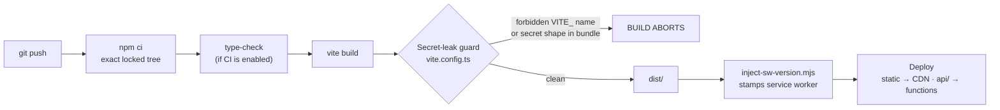

# Deployment Runbook

**Last verified: 2026-09-26** · against commit `37c2505f487fd1d43ab73eb7ec3d909767e7546f` (2026-09-12)

Target platform: **Vercel**. The `api/` directory becomes serverless functions;
`dist/` becomes the static frontend.

> **Environment note.** This runbook describes the deploy as configured in the
> repository (`vercel.json`, `package.json` scripts, `vite.config.ts`). The
> security-header step in §4 depends on a `vercel.json` `headers` block that is
> **not present in `main`** — it was produced as a patch during the audit and is
> not applied. Do not assume your deployment is stamping headers until you check
> §4.1 against the live site.

---

## 1. First deploy

### 1.1 Prerequisites

- A Supabase project (URL, anon key, service-role key).
- A Regolo AI API key — <https://regolo.ai>.
- A Vercel account with the repository connected.
- All **nine** migrations in `supabase/migrations/` applied, in order.

### 1.2 Apply the database schema FIRST

Do not deploy before the schema exists. The failure mode is not a clean error; it
is a boot with handlers that throw on every data call.

```bash
# Option A — Supabase CLI (applies every migration in lexicographic order)
supabase link --project-ref <your-project-ref>
supabase db push

# Option B — by hand in the Supabase SQL editor, oldest first, ONE FILE AT A TIME
#   20240101000000_initial_schema.sql          15 tables + RLS enable
#   20240101000100_rls_audit.sql               is_admin() + policy fixes
#   20240101000200_rate_limits.sql             rate_limits + atomic RPC
#   20240101000300_subscription_tiers.sql      subscription_tier column
#   20240101000400_security_hardening.sql      triggers, column locks
#   20240101000500_storage_lifecycle.sql       storage cleanup triggers
#   20240101000600_rate_limit_hardcap.sql      HARD_CAP short-circuit
#   20240101000700_users_auth_fk.sql           users.id → auth.users FK
#   20240101000800_advisor_reactions.sql       reactions + subscription_expires_at
```

**Never run the legacy scripts.** `supabase-schema-v2.sql`,
`scripts/rls-audit.sql`, and `scripts/create-rate-limits-table.sql` duplicate
schema that the migrations already own. Applying them alongside the migrations
produces conflicting definitions, and in the case of the rate-limit table, two
competing versions of the same function.

**Verify after applying:**

```sql
-- Expect 16 rows, every one with relrowsecurity = true
select relname, relrowsecurity from pg_class
where relnamespace = 'public'::regnamespace and relkind = 'r'
order by relname;

-- Expect the atomic limiter to exist
select proname, pg_get_function_arguments(oid) from pg_proc
where proname = 'record_and_count_rate_limit';

-- Expect the is_admin() helper to exist
select proname from pg_proc where proname = 'is_admin';
```

If `record_and_count_rate_limit` is missing, production rate limiting has no
working backend. Do not deploy until it exists.

### 1.3 Environment variables

Set these in **Vercel → Project → Settings → Environment Variables**. The full
annotated list is [`.env.example`](../../.env.example); the mandatory four are:

| Variable | Scope | Notes |
| --- | --- | --- |
| `VITE_SUPABASE_URL` | All | Client-visible. **Note:** the backend also reads this name — see §7. |
| `VITE_SUPABASE_ANON_KEY` | All | Client-visible by design; RLS is the control |
| `SUPABASE_SERVICE_ROLE_KEY` | Production, Preview | **Secret.** Bypasses RLS. **No `VITE_` prefix.** |
| `REGOLO_API_KEY` | Production, Preview | **Secret. No `VITE_` prefix.** |

Strongly recommended: `SENTRY_DSN`, `VITE_SENTRY_DSN`, `APP_URL`,
`ALLOWED_ORIGINS`.

**Do not set any Stripe variable** — the integration is not live, and setting
`STRIPE_SECRET_KEY` on an unbuilt feature only adds a secret to protect.

**The prefix rule, restated because it is the one that causes breaches:** a
`VITE_`-prefixed variable is inlined into the client bundle at build time and
served to every visitor. `vite.config.ts` has a build-time guard that aborts the
build on a forbidden name — treat a build failure there as the guard working, and
investigate rather than bypass.

### 1.4 Build settings

| Setting | Value |
| --- | --- |
| Framework preset | Vite |
| Build command | `npm run build` |
| Output directory | `dist` |
| Install command | `npm ci` |
| Node version | **>= 20.0.0** (declared in `engines`) |

**Use `npm ci`, not `npm install`.** `npm ci` installs the exact locked tree and
fails if `package.json` and `package-lock.json` disagree — which is exactly when
you want to know. `npm install` quietly re-resolves and can ship a dependency
version nobody tested.

### 1.5 Deploy

```bash
git push origin main
# Vercel builds and deploys automatically.
```

---

## 2. The build pipeline



**Step E is a real gate.** If the build fails there, a secret is about to be
published. Investigate the reported name; do not remove the guard.

**Step H matters more than it looks.** The service worker version is stamped at
build time so that a new deploy invalidates the cached shell. A build that skips
the stamp ships a stale service worker, and users keep a cached bundle after a
deploy — the "my fix isn't showing up" bug. If you change the build command, keep
this step.

---

## 3. Verify the deploy

A deploy that returns `200` is not a deploy that works. Run all of these.

```bash
DOMAIN=https://<your-domain>

# 1. API alive
curl -s $DOMAIN/api/health
# Expect 200 + a JSON body.

# 2. Key-configured check — must NOT echo the key
curl -s $DOMAIN/api/ai/test-key
# Expect a boolean or status flag. Any string resembling the key is a leak.

# 3. Unauthenticated access is refused
curl -s -o /dev/null -w '%{http_code}\n' $DOMAIN/api/advisor/session
# Expect 401, NOT 200 and NOT 500. A 500 means an unhandled throw on the
# missing-user path, which is both a bug and an information leak.

# 4. CSRF gate is fail-closed
curl -s -o /dev/null -w '%{http_code}\n' -X POST $DOMAIN/api/oracle/analyses \
  -H 'Content-Type: application/x-www-form-urlencoded' -d 'x=1'
# Expect 403 CSRF_CHECK_FAILED. A 200 means the gate is not running.

# 5. The static document serves
curl -s -o /dev/null -w '%{http_code}\n' $DOMAIN/
```

Then in a browser:

- [ ] Sign in with a real account.
- [ ] Run one Oracle analysis end to end.
- [ ] Open the advisor and confirm the **first token arrives before the full
      reply** — an SSE route that buffers compression will look like a slow
      non-streaming response.
- [ ] Toggle dark → light → dark and confirm the theme persists across a reload.
- [ ] Open devtools → Network and confirm **no** request to
      `fonts.googleapis.com` *(only after the font patch is applied; see §7)*.
- [ ] Hard-reload and confirm the service worker does not serve a stale bundle.

---

## 4. Security headers

### 4.1 Check what is actually being served

```bash
curl -sI $DOMAIN/ | grep -iE \
  'content-security-policy|strict-transport-security|x-frame-options|referrer-policy|permissions-policy'
```

Expected on a properly configured deploy:

| Header | Expected |
| --- | --- |
| `Content-Security-Policy` | Present, with `script-src` excluding `'unsafe-inline'` |
| `Strict-Transport-Security` | `max-age=63072000; includeSubDomains` |
| `X-Frame-Options` | `DENY` or `SAMEORIGIN` |
| `Referrer-Policy` | `strict-origin-when-cross-origin` |
| `Permissions-Policy` | Camera/microphone/geolocation restricted |
| `X-Content-Type-Options` | `nosniff` |

**Expect empty output on the current `main`.** `vercel.json` has no `headers`
block. Closing this requires adding one (a patch exists from the audit and is not
applied). Until then the deployment is serving the document without a CSP or
HSTS, which is a clickjacking and first-visit-downgrade exposure.

### 4.2 The CSP versus the inline theme script

The CSP built in `api/lib/http.ts` excludes `'unsafe-inline'` from `script-src`.
`index.html` contains an inline `<script>` that applies the saved theme before
React hydrates.

**These two facts are incompatible: in production, the inline script is blocked.**
The observable symptom is a flash of the default theme on reload for a user with
a saved light-theme preference — easy to dismiss as a cosmetic quirk, and it is
actually a blocked script.

Fixing it means moving the script into `public/theme-bootstrap.js` and
referencing it from `index.html`. Adding `'unsafe-inline'` "fixes" the flash by
removing the protection; do not.

### 4.3 Headers must agree between environments

The security headers are defined in `api/lib/http.ts` (so the Express path and the
Vercel function stamp the same ones) and separately in `vercel.json` (for the
static document, which never passes through the API code).

**Two sources of truth is one too many.** A divergence is silent and asymmetric:
API responses carry one policy, the HTML document carries another. After any
header change, diff the live API response against the live document:

```bash
curl -sI $DOMAIN/api/health | grep -i 'content-security-policy'
curl -sI $DOMAIN/          | grep -i 'content-security-policy'
```

---

## 5. Database migrations on a live system

**Rules, in order of how much damage each violation causes.**

1. **Never edit an applied migration.** Its checksum is recorded; editing it makes
   every environment disagree with every other. Add a new timestamped file.
2. **Additive first, destructive later.** Add a column, deploy code that reads it,
   *then* drop the old one in a later migration. A migration and a deploy are two
   events and the gap between them is where production breaks.
3. **`CREATE INDEX CONCURRENTLY`** for a large table. A plain `CREATE INDEX`
   takes a write lock and the site goes down for the duration.
4. **Every new table gets RLS in the same migration.** A table created without RLS
   is readable by anyone holding the anon key — which is every visitor's browser.
   There is no "we'll add policies next sprint" that survives a determined
   visitor.
5. **Back up before a destructive migration.** Supabase has point-in-time
   recovery on paid tiers; on the free tier, export first.

### Rollback

| Change | Rollback |
| --- | --- |
| Frontend code | Redeploy the previous commit in Vercel |
| Serverless function | Same |
| **Migration** | **Not automatic.** Write the inverse migration and test it *before* applying the forward one. |
| Tier data | A code rollback does not change anyone's tier. Tiers are data. |

**Rehearse destructive migrations against a Supabase branch or a restoration of
production, never against production directly.** A migration that has never run
anywhere but a developer's laptop is not tested, it is untried.

---

## 6. Monitoring after a deploy

First 15 minutes, in priority order: error rate in Sentry; `/api/health`;
`401`/`403`/`429` rates on `/api/*`; function duration p95 (a jump usually means
an upstream AI call is hanging, not that the code got slower).

Full instrumentation detail: [`monitoring.md`](./monitoring.md).

---

## 7. Known gaps that affect deployment

Check each of these against the repository before relying on the deploy being
complete. All were verified absent from `main` at the last verified date.

| # | Gap | Deploy impact | Status |
| --- | --- | --- | --- |
| 1 | **No `vercel.json` `headers` block** | No CSP, HSTS, or `X-Frame-Options` on the HTML document | Not applied |
| 2 | **CSP blocks the inline theme script** | Theme-bootstrap does not run in production; flash on reload | Not applied |
| 3 | **Fonts loaded from `fonts.googleapis.com`** | Blocking cross-origin request with no `preconnect` delays first paint | Not applied |
| 4 | **20 production dependency advisories** | Vulnerable code in the deployed tree, incl. a critical `tar` reached via `@vercel/node` | Not applied |
| 5 | **`@vercel/node` is a production dependency** but used only for a type-only import | Unnecessarily ships a vulnerable chain into the deployed bundle | Not applied |
| 6 | **Backend reads `VITE_SUPABASE_URL`** for its own server-side Supabase client | Works, because Vercel exposes the variable to functions too — but the naming implies a client-only value and invites a future mistake | Unresolved |
| 7 | **No CI pipeline** | Nothing verifies the type-check, tests, or build before a deploy | Not started |
| 8 | **`public/favicon.svg` missing** while `index.html` references it | A 404 on every page load | Not applied |
| 9 | **`tsconfig.tsbuildinfo` tracked** | Not deployed (`.vercelignore`), but pollutes the repo | Unresolved |
| 10 | **No `trust proxy`** on the Express path | Irrelevant on Vercel (serverless, one request per instance); **breaks rate limiting for a self-hosted Express deploy** | Unresolved |

**Item 10 is the one to internalise if you self-host.** The production path on
Vercel is fine. But the repository also ships an Express server, and a reader who
deploys *that* behind a reverse proxy gets a single shared rate-limit bucket —
one user's traffic exhausts everyone's allowance. Add `app.set('trust proxy', 1)`
before trusting `req.ip`.

---

## 8. Deploy checklist

```
BEFORE
[ ] All 9 migrations applied in order; verified with the three SQL checks in §1.2
[ ] record_and_count_rate_limit exists in the database
[ ] Four required env vars set (SERVICE_ROLE and REGOLO with no VITE_ prefix)
[ ] npm run lint:all && npm test && npm run build — all green locally
[ ] No .env file staged (git status)
[ ] Previous commit SHA recorded for rollback

DURING
[ ] Build completes; secret-leak guard passes
[ ] Vercel build log free of warnings about missing env vars

AFTER
[ ] curl /api/health → 200
[ ] curl /api/ai/test-key → boolean, not a key
[ ] curl /api/advisor/session unauthenticated → 401
[ ] POST with a form content type → 403 CSRF_CHECK_FAILED
[ ] curl -I / → security headers (expect MISSING until §4 is fixed)
[ ] Sign in, run one Oracle analysis, one advisor message
[ ] Advisor streams — first token BEFORE the full reply
[ ] Dark/light toggle persists across reload
[ ] Sentry receiving events (if a DSN is set)

ROLLBACK READY
[ ] Previous SHA noted
[ ] Destructive migrations have a tested inverse
```

---

**Last verified: 2026-09-26**
